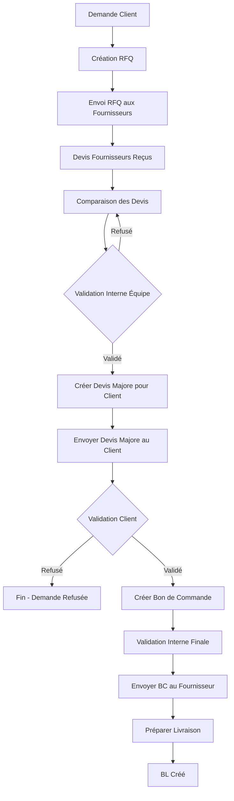

# Workflow Complet de Validation - Devis Fournisseur → Devis Client → Bon de Commande

## Vue d'ensemble

Ce document décrit le workflow complet de validation des devis, depuis la réception des devis fournisseurs jusqu'à la création du bon de commande final.

## Flux de travail

## Étapes détaillées

### 1. Réception des Devis Fournisseurs
- Les fournisseurs soumettent leurs devis via le formulaire externe ou l'interface interne
- Statut initial : `envoye` (devis fournisseur)
- Validation interne : `en_attente_validation`

### 2. Comparaison des Devis
- Page : `devis-compare.html?rfq=X`
- Affichage de tous les devis reçus pour une RFQ
- Comparaison des prix, délais, conditions
- Sélection des meilleurs devis

### 3. Validation Interne des Devis Fournisseurs
- **Obligatoire** avant de créer le devis majore
- Page : `devis-compare.html`
- Actions :
  - Valider les devis sélectionnés
  - Refuser les devis non conformes
  - Ajouter des commentaires
- Statut : `valide_interne` ou `refuse_interne`
- **Important** : Seuls les devis validés peuvent être utilisés pour créer le devis client

### 4. Création du Devis Majore pour le Client
- Route : `POST /api/devis/create-for-client`
- Page : `devis-compare.html`
- Processus :
  1. Sélection des devis fournisseurs validés
  2. Sélection des lignes à inclure
  3. Application de la marge commerciale
  4. Création du devis client avec prix majorés
- Résultat : Devis client créé avec statut `envoye`
- **Type** : Devis client (différent du devis fournisseur)

### 5. Envoi du Devis Majore au Client
- Le devis client est envoyé au client qui a fait la demande initiale
- Notification par email/WhatsApp
- Le client peut consulter le devis sur la plateforme

### 6. Validation Client du Devis Majore
- **Obligatoire** avant de créer le bon de commande
- Le client doit valider le devis majore
- Statut : `accepte` ou `refuse`
- Si refusé : Le processus s'arrête
- Si accepté : Passage à l'étape suivante

### 7. Création du Bon de Commande
- Route : `POST /api/commandes` (depuis devis client accepté)
- Page : `devis-detail.html` (devis client)
- Vérifications :
  - ✅ Devis client validé (`statut = 'accepte'`)
  - ✅ Devis fournisseur validé en interne (`validation_interne = 'valide_interne'`)
- Résultat : Bon de commande créé avec statut `brouillon`

### 8. Validation Interne Finale
- Vérification finale par l'équipe
- Confirmation que tout est en ordre
- Préparation de l'envoi au fournisseur

### 9. Envoi du Bon de Commande au Fournisseur
- Route : `POST /api/commandes/:id/send-to-supplier`
- Page : `commandes-detail.html`
- Actions :
  - Mise à jour du statut à `envoye`
  - Notification WhatsApp/Email au fournisseur
  - Création d'une notification système

### 10. Préparation de la Livraison
- Le fournisseur prépare la commande
- Création du BL (Bon de Livraison)
- Suivi de la livraison

## Types de Devis

### Devis Fournisseur
- **Source** : Soumis par le fournisseur
- **Table** : `devis` avec `rfq_id` non NULL
- **Champ** : `fournisseur_id` = ID du fournisseur
- **Validation** : `validation_interne` (en_attente_validation, valide_interne, refuse_interne)
- **Usage** : Comparaison et sélection

### Devis Client (Majore)
- **Source** : Créé depuis les devis fournisseurs validés
- **Table** : `devis` avec `rfq_id` = NULL
- **Champ** : `fournisseur_id` = ID du client (entreprise)
- **Champ** : `demande_devis_id` = ID de la demande initiale
- **Validation** : `statut` (envoye, accepte, refuse)
- **Usage** : Envoi au client pour validation

## Statuts et Validations

### Devis Fournisseur
- `statut` : `envoye` (reçu du fournisseur)
- `validation_interne` : 
  - `en_attente_validation` (par défaut)
  - `valide_interne` (validé par l'équipe)
  - `refuse_interne` (refusé par l'équipe)

### Devis Client
- `statut` :
  - `envoye` (créé et envoyé au client)
  - `accepte` (validé par le client)
  - `refuse` (refusé par le client)

### Commande
- `statut` :
  - `brouillon` (créée, en attente d'envoi)
  - `envoye` (envoyée au fournisseur)
  - `en_preparation` (en préparation)
  - `livree` (livrée)

## Contrôles de Validation

### Avant Création Devis Client
- ✅ Tous les devis fournisseurs sélectionnés doivent être `valide_interne`
- ❌ Si un devis n'est pas validé → Erreur avec liste des devis non validés

### Avant Création Bon de Commande
- ✅ Devis client doit être `accepte`
- ✅ Devis fournisseur associé doit être `valide_interne`
- ❌ Si conditions non remplies → Erreur explicite

### Avant Envoi BC au Fournisseur
- ✅ Commande doit être `brouillon` ou `envoye`
- ✅ Toutes les validations doivent être complètes

## Notifications

### Validation Interne
- Notification système lors de la validation/refus
- Enregistrement dans l'historique

### Validation Client
- Notification au client lors de l'envoi du devis majore
- Notification à l'équipe lors de la validation/refus client

### Envoi BC
- Notification WhatsApp/Email au fournisseur
- Notification système à l'équipe

## Pages et Routes

### Pages Frontend
- `devis-compare.html` : Comparaison et validation interne
- `devis-detail.html` : Détails devis (fournisseur ou client)
- `commandes-detail.html` : Détails commande et envoi au fournisseur

### Routes Backend
- `POST /api/devis/:id/validate-internal` : Validation interne
- `POST /api/devis/create-for-client` : Création devis majore
- `PATCH /api/devis/:id/statut` : Validation client (statut = accepte)
- `POST /api/commandes` : Création bon de commande
- `POST /api/commandes/:id/send-to-supplier` : Envoi BC au fournisseur

## Exemple de Workflow Complet

1. **Client fait une demande** : `DEV-MKIPO6O1-3985CB`
2. **RFQ créée** : `RFQ-2025-0001` envoyée à 3 fournisseurs
3. **Devis reçus** :
   - Devis Fournisseur A : 100,000 GNF (validation_interne: en_attente)
   - Devis Fournisseur B : 95,000 GNF (validation_interne: en_attente)
   - Devis Fournisseur C : 110,000 GNF (validation_interne: en_attente)
4. **Comparaison** : Page `devis-compare.html?rfq=1`
5. **Validation interne** : 
   - Devis B validé → `valide_interne`
   - Devis A et C refusés → `refuse_interne`
6. **Création devis majore** :
   - Prix fournisseur : 95,000 GNF
   - Marge : 20%
   - Prix client : 114,000 GNF
   - Devis client créé : `DEV-CLIENT-2025-0001`
7. **Envoi au client** : Notification envoyée
8. **Validation client** : Client accepte → `statut = accepte`
9. **Création BC** : Bon de commande créé depuis devis client accepté
10. **Envoi au fournisseur** : BC envoyé au Fournisseur B
11. **Livraison** : Fournisseur prépare et livre

## Notes Importantes

- La validation interne est **obligatoire** avant création du devis majore
- La validation client est **obligatoire** avant création du bon de commande
- Les deux validations sont indépendantes et nécessaires
- Le workflow peut être interrompu à tout moment si une validation échoue
- Toutes les actions sont tracées dans l'historique

