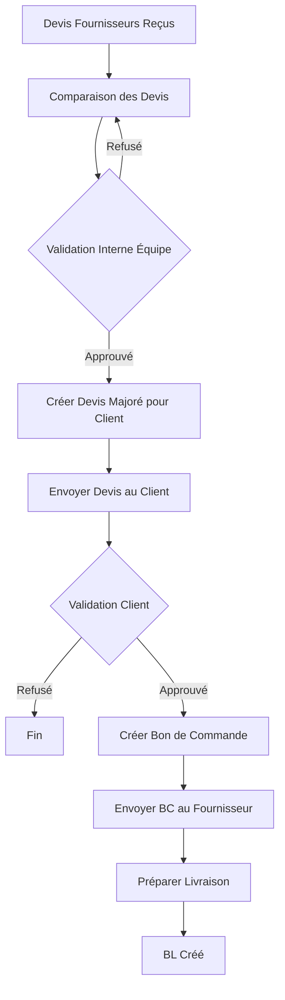

# Workflow de Validation Interne - Implémentation

## Vue d'ensemble

Ce document décrit l'implémentation complète du workflow de validation interne des devis fournisseurs, permettant à l'équipe de valider les devis avant de créer le devis majoré pour le client.

## Modifications apportées

### 1. Base de données

#### Migration SQL
- **Fichier MySQL**: `database/migration_validation_interne_devis.sql`
- **Fichier PostgreSQL**: `database/migration_validation_interne_devis_postgresql.sql`
- **Script d'exécution**: `database/run_migration_validation_interne.sh`

#### Nouveaux champs dans la table `devis`:
- `validation_interne`: ENUM('en_attente_validation', 'valide_interne', 'refuse_interne') - Statut de validation
- `commentaire_validation_interne`: TEXT - Commentaires de l'équipe
- `valide_par_id`: INT - ID de l'utilisateur qui a validé
- `date_validation_interne`: DATETIME - Date de validation

### 2. Backend

#### Routes ajoutées/modifiées dans `backend/routes/devis.js`:

1. **POST /api/devis/:id/validate-internal**
   - Valide ou refuse un devis fournisseur en interne
   - Paramètres: `action` ('valider' ou 'refuser'), `commentaire` (optionnel)
   - Met à jour le statut de validation interne

2. **POST /api/devis/validate-internal-batch**
   - Valide ou refuse plusieurs devis simultanément
   - Paramètres: `devis_ids` (array), `action`, `commentaire` (optionnel)

3. **POST /api/devis/create-for-client** (modifiée)
   - Vérifie maintenant que tous les devis fournisseurs sont validés en interne (`validation_interne = 'valide_interne'`)
   - Retourne une erreur si des devis ne sont pas validés

#### Routes modifiées dans `backend/routes/factures.js`:

1. **POST /api/factures/proforma-from-devis** (modifiée)
   - Vérifie maintenant que tous les devis fournisseurs sont validés en interne
   - Retourne une erreur détaillée si des devis ne sont pas validés

#### Routes ajoutées dans `backend/routes/commandes.js`:

1. **POST /api/commandes/:id/send-to-supplier**
   - Envoie le bon de commande au fournisseur
   - Met à jour le statut de la commande à 'envoye'
   - Envoie des notifications WhatsApp et email au fournisseur
   - Crée une notification dans le système

### 3. Frontend

#### Modifications dans `frontend/devis-compare.html`:

1. **Affichage du statut de validation interne**
   - Nouvelle ligne dans le tableau de comparaison affichant le statut de validation
   - Badge coloré selon le statut (orange: en attente, vert: validé, rouge: refusé)
   - Affichage de la date de validation et des commentaires

2. **Section de validation interne**
   - Nouvelle section avec boutons "Valider" et "Refuser"
   - Checkboxes pour sélectionner les devis à valider
   - Compteur de devis sélectionnés

3. **Modal de validation**
   - Modal pour valider/refuser avec commentaire optionnel
   - Liste des devis concernés
   - Confirmation avant validation

4. **Avertissement**
   - Message d'avertissement si des devis ne sont pas validés avant création de facture proforma
   - Gestion d'erreur améliorée avec liste des devis non validés

## Workflow complet



## Utilisation

### 1. Exécuter la migration

```bash
cd database
./run_migration_validation_interne.sh
```

Ou manuellement:
- MySQL: `mysql -u user -p database < migration_validation_interne_devis.sql`
- PostgreSQL: `psql $DATABASE_URL -f migration_validation_interne_devis_postgresql.sql`

### 2. Valider des devis en interne

1. Aller sur la page de comparaison des devis (`devis-compare.html?rfq=X`)
2. Cocher les devis à valider
3. Cliquer sur "Valider les devis sélectionnés"
4. Ajouter un commentaire (optionnel)
5. Confirmer

### 3. Créer une facture proforma

1. S'assurer que tous les devis sont validés (badge vert)
2. Cliquer sur "Créer facture proforma"
3. Sélectionner les lignes et le client
4. La facture proforma sera créée uniquement si tous les devis sont validés

### 4. Envoyer le bon de commande au fournisseur

1. Après validation client de la proforma, une commande est créée
2. Sur la page de détails de la commande, cliquer sur "Envoyer au fournisseur"
3. Le fournisseur recevra une notification WhatsApp/Email

## Statuts de validation interne

- `en_attente_validation`: Devis reçu, en attente de validation par l'équipe
- `valide_interne`: Devis validé par l'équipe, peut être utilisé pour créer le devis client
- `refuse_interne`: Devis refusé par l'équipe, ne peut pas être utilisé

## Notifications

- Notification système lors de la validation/refus d'un devis
- Notification WhatsApp/Email au fournisseur lors de l'envoi du bon de commande
- Notification dans l'historique client

## Sécurité

- Seuls les utilisateurs authentifiés peuvent valider des devis
- La validation est enregistrée avec l'ID de l'utilisateur qui a validé
- Les devis non validés ne peuvent pas être utilisés pour créer des factures proforma

## Tests

Pour tester le workflow complet:

1. Créer une RFQ et recevoir des devis
2. Comparer les devis sur `devis-compare.html`
3. Valider les devis sélectionnés
4. Créer une facture proforma (doit fonctionner)
5. Essayer de créer une facture proforma avec des devis non validés (doit échouer avec message clair)
6. Valider la proforma côté client
7. Envoyer le bon de commande au fournisseur

## Fichiers modifiés

- `database/migration_validation_interne_devis.sql` (nouveau)
- `database/migration_validation_interne_devis_postgresql.sql` (nouveau)
- `database/run_migration_validation_interne.sh` (nouveau)
- `backend/routes/devis.js` (modifié)
- `backend/routes/factures.js` (modifié)
- `backend/routes/commandes.js` (modifié)
- `frontend/devis-compare.html` (modifié)

## Notes importantes

- Les devis existants auront le statut `en_attente_validation` par défaut
- La validation interne est obligatoire avant de créer une facture proforma
- Le workflow peut être contourné en validant directement les devis via l'API si nécessaire
- Les notifications WhatsApp nécessitent la configuration de MessagePro

